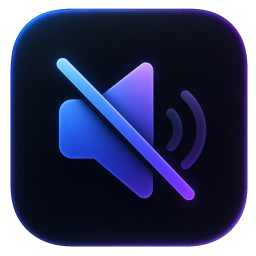
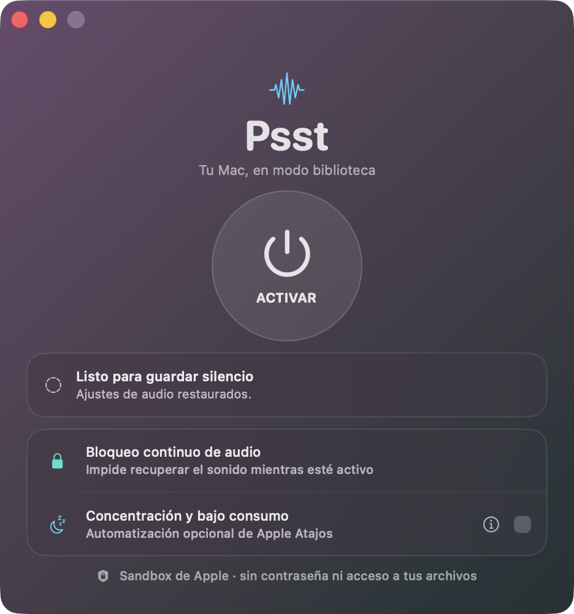

<div align="center">
  

  # Psst — Mac Silence

  **Tu Mac, en modo biblioteca: menos interrupciones y menos ruido.**

  [](https://github.com/Fernando-Marcos/psst-mac-silence/actions/workflows/ci.yml)
  [](https://github.com/Fernando-Marcos/psst-mac-silence/releases/latest)
  [](LICENSE)
  
  
</div>

Psst es una utilidad nativa, pequeña y transparente para preparar el Mac antes de estudiar, opositar o trabajar en un espacio silencioso. Mientras el modo biblioteca está activo, mantiene bloqueada la salida de audio, corrige cualquier intento de recuperar el volumen y muestra un aviso; al desactivarlo restaura el estado anterior.

<p align="center">
  
</p>

## Por qué instalar Psst

### Para estudiantes

- Evita que Spotify, un vídeo, una web o una alerta recuperen el sonido por accidente en clase o en la biblioteca.
- Convierte el inicio de una sesión de estudio en un ritual inmediato y fácil de recordar.
- Ocupa poco espacio, permanece accesible en la barra de menús y no añade distracciones.

### Para opositores

- Reduce pasos repetitivos antes de cada bloque largo de estudio.
- Puede iniciar una automatización personal de No molestar y Bajo consumo creada en Atajos.
- Restaura el audio previo al terminar, sin obligarte a recordar cómo estaba configurado.

### Para bibliotecas y espacios compartidos

- Mantiene silenciadas las salidas compatibles y los sonidos del sistema mediante Core Audio durante toda la sesión.
- Avisa si detecta actividad de audio o un intento de volver a subir el volumen.
- Ayuda a evitar interrupciones involuntarias sin tocar el control térmico del equipo.
- No necesita contraseña de administrador, cuenta, Internet ni procesos en segundo plano fuera de la app.

## Diseño compacto y nativo

La ventana fija mide 468 × 500 puntos con el marco de macOS: es prácticamente cuadrada y no tiene desplazamiento. Usa materiales translúcidos de AppKit para integrarse con el escritorio y respeta Reducir transparencia de macOS. Psst también está disponible desde la barra de menús.

## Seguridad Apple por diseño

- **App Sandbox activo** con un único entitlement: `com.apple.security.app-sandbox`.
- **Sin privilegios de administrador**, AppleScript, Apple Events, comandos de shell o procesos auxiliares.
- **Sin acceso** a red, cámara, micrófono, contactos ni archivos elegidos por el usuario.
- Audio controlado con la API pública **Core Audio**.
- Automatización opcional iniciada por el usuario con el esquema oficial `shortcuts://`.
- Estado reversible guardado exclusivamente en el contenedor privado de la app.

Psst bloquea el **sonido audible** de la salida predeterminada compatible. Por seguridad y privacidad no inspecciona ni controla el reproductor de Spotify, el navegador o una app de vídeo: su reproducción puede avanzar sin que se oiga nada. Algunas salidas digitales o externas que no permiten volumen o mute por software quedan fuera del control de cualquier app sandboxed; Psst lo comunica si no puede silenciarlas.

La configuración cumple la base técnica del sandbox exigido por Apple. Una publicación en Mac App Store todavía requiere firma de distribución, perfil, ficha de App Store Connect y revisión de Apple.

## Ventiladores y bajo consumo

Psst no baja directamente las revoluciones de los ventiladores. Apple no publica una API para ello, y forzar menos refrigeración podría sobrecalentar el Mac. macOS conserva siempre el control térmico.

Si quieres reducir el calor que hace acelerar los ventiladores, puedes activar la integración con Atajos y crear:

1. `Psst Activar biblioteca`, con las acciones de Apple para activar No molestar y Bajo consumo disponibles en tu macOS.
2. `Psst Desactivar biblioteca`, con las acciones inversas.

Psst abre el atajo cuando pulsas Activar o Desactivar. No enumera, lee ni modifica tu biblioteca de atajos.

## Instalación

1. Descarga el ZIP universal desde [la última versión](https://github.com/Fernando-Marcos/psst-mac-silence/releases/latest).
2. Descomprímelo y mueve `Psst.app` a **Aplicaciones**.
3. Abre Psst. Las compilaciones de GitHub con firma ad hoc pueden requerir clic derecho → **Abrir** la primera vez.

## Compilar y verificar

Necesitas macOS 13 o posterior y las Command Line Tools de Apple.

```bash
git clone https://github.com/Fernando-Marcos/psst-mac-silence.git
cd psst-mac-silence
./Scripts/test.sh
./Scripts/build-app.sh
codesign -dvvv --entitlements - build/Psst.app
open build/Psst.app
```

El binario generado es universal para Apple Silicon e Intel. La integración continua valida pruebas, firma, sandbox y ambas arquitecturas.

## Documentación

- [Arquitectura y decisiones de seguridad](docs/ARCHITECTURE.md)
- [Privacidad](PRIVACY.md)
- [Política de seguridad](SECURITY.md)
- [Cómo contribuir](CONTRIBUTING.md)
- [Historial de cambios](CHANGELOG.md)

## Licencia

Psst se distribuye bajo la [licencia MIT](LICENSE).
